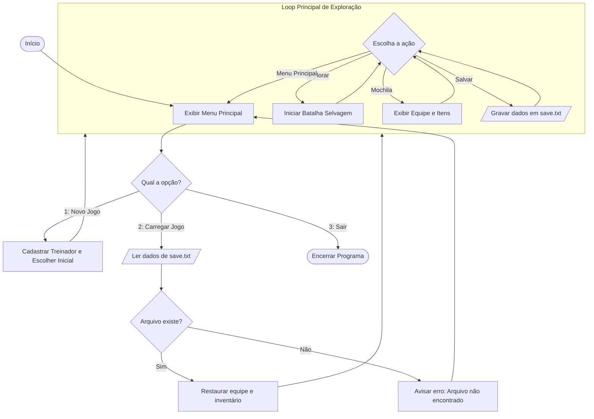
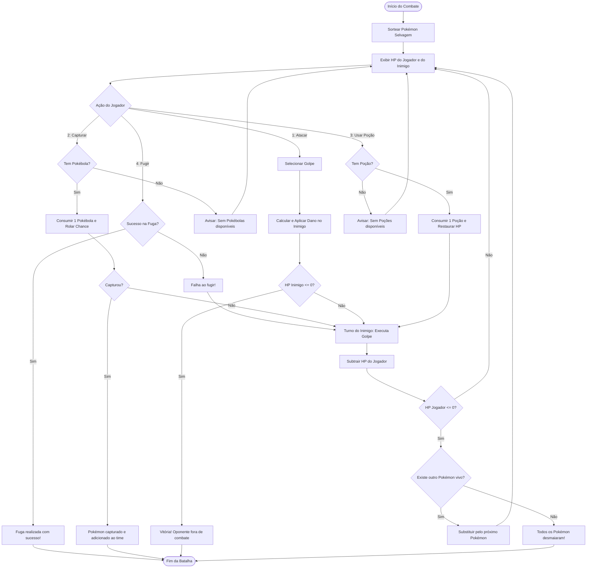

# RPG Pokémon em C (Terminal)

**Disciplina:** Linguagem e Técnicas de Programação  
**Docente:** Prof. Dacio Machado  
**Curso:** Engenharia de Software / ADS  
**Avaliação Inicial:** 24 de Setembro de 2026  

---

## 1. Integrantes da Equipe

| Nome Completo | RA | Responsabilidade Principal |
| :--- | :--- | :--- |
| João Vitor Cardoso da Silva | 26001322-2 | Arquitetura geral, fluxo principal (`main.c`) persistência e documentação técnica|
| Arthur Navarete | 26002044-2 | Modelagem de dados (`pokemon.h` / `tone.h`) catálogo de criaturas e sistema de inventário e musica tema do jogo|
| André Dias | 26001552-2 | Mecânica de combate (`batalha.c` / `batalha.h`)cálculo de dano e capturas |


---

## 2. Descrição e Definição do Problema

O projeto consiste no desenvolvimento de um jogo de RPG de turnos executado via terminal de comandos (console), inspirado no universo Pokémon. O usuário atua como um treinador que explora rotas, enfrenta criaturas selvagens em combates por rodadas, gerencia itens de suporte (poções e pokébolas), recruta novos monstrinhos para a equipe e salva o progresso em disco.

O desenvolvimento abrange todos os conceitos fundamentais exigidos na ementa da disciplina:
* **Entrada e Saída:** Menus intuitivos e mensagens descritivas ao usuário.
* **Estruturas de Controle:** Loops de repetição (`while`, `for`) e desvios condicionais (`switch-case`, `if-else`).
* **Modularização:** Organização rigorosa em arquivos de cabeçalho (`.h`) e código fonte (`.c`).
* **Estruturas de Dados:** Vetores homogêneos e registros heterogêneos compostos (`struct`).
* **Persistência em Arquivos:** Gravação e recuperação de savegames via `fopen`, `fprintf`, `fscanf` e `fclose`.

---

## 3. Arquitetura do Sistema e Modularização

O projeto adota uma divisão modular limpa para manter o código testável e desacoplado:

```text
pokemon-rpg/
├── docs/
│   └── documento_entrega_24_set.pdf
├── include/
│   ├── pokemon.h       # Declarações das structs e catálogo de Pokémon/ataques
│   ├── batalha.h       # Protótipos das funções do motor de combate
│   └── arquivos.h      # Protótipos das rotinas de salvar/carregar jogo
|   └── tone.h          # Musica tema do jogo
├── src/
│   ├── pokemon.c       # Implementação das regras dos Pokémon
│   ├── batalha.c       # Implementação do ciclo de rodadas e cálculo de dano
│   ├── arquivos.c      # Implementação do tratamento e leitura/escrita de arquivos
│   └── main.c          # Ponto de entrada, menu inicial e loop central
         
├── data/
│   └── save.txt        # Registro persistente dos dados do jogador
└── README.md           # Documentação técnica do repositório
```

---

## 4. Modelagem de Dados (`structs`)

O projeto faz uso de estruturas heterogêneas aninhadas e vetores para mapear as entidades do jogo:

```c
#ifndef POKEMON_H
#define POKEMON_H

#define MAX_ATAQUES 4
#define MAX_TIME 6

// Representação de uma habilidade/golpe
typedef struct {
    char nome[30];
    int poder;
    char tipo[15]; // "Fogo", "Agua", "Planta", "Normal"
} Ataque;

// Representação de uma criatura
typedef struct {
    char nome[30];
    char tipo[15];
    int vida_max;
    int vida_atual;
    int nivel;
    int ataque;
    int defesa;
    Ataque ataques[MAX_ATAQUES]; // Vetor homogêneo de structs
} Pokemon;

// Representação do Jogador / Treinador
typedef struct {
    char nome[50];
    Pokemon time[MAX_TIME];
    int qtd_pokemon;
    int pokebolas;
    int pocoes;
} Treinador;

#endif
```

---

## 5. Fluxogramas e Estrutura Lógica

### 5.1 Fluxo Geral da Aplicação



### 5.2 Lógica de Combate por Turnos



---

## 6. Tratamento de Erros e Validações

* **Tratamento de Arquivos:** Verificação defensiva de ponteiro (`FILE *fptr != NULL`). Se `save.txt` estiver corrompido ou ausente no carregamento, o usuário é alertado sem que ocorra crash (*segmentation fault*). Todo fluxo encerra seus descritores com `fclose()`.
* **Proteção de Vetores e Menus:** Validação contra valores numéricos inválidos nos menus e na seleção de ataques para prevenir acessos a posições indevidas de memória.
* **Consistência de Dados de Combate:** Travas para que valores de vida (`vida_atual`) nunca ultrapassem `vida_max` após uso de poção e nunca fiquem negativos em tela após ataques.
